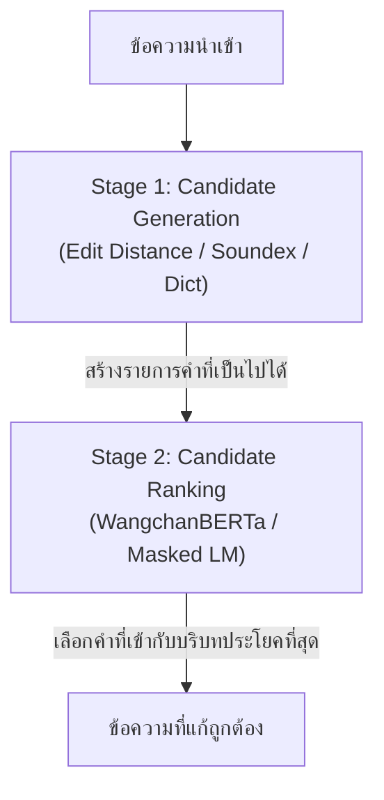
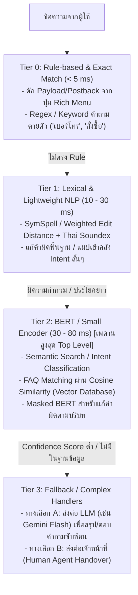

# ออกแบบฟังก์ชัน LINE Chatbot สำหรับ Yuedpao
**Source URL**: https://gemini.google.com/app/708e776479369aca
**Original Prompt**: `https://www.yuedpao.com ช่วยเข้าไปดู รายละเอียดแล้วออกแบบ line chatbot หน่อยว่าเราควรให้มีฟังก์ชันอะไรบ้าง`

---

## 📌 Context & Analysis
จากการวิเคราะห์โครงสร้างสินค้า บริการ และพฤติกรรมลูกค้าจากเว็บไซต์ Yuedpao (ยืดเปล่า) แบรนด์มีจุดเด่นเรื่องนวัตกรรมเนื้อผ้า (เช่น ไม่ต้องรีด, Ultrasoft, Tailor Cool Polo, MotionSkin สปอร์ต) มีทั้งช่องทางออนไลน์และสาขาหน้าร้านจำนวนมาก

การออกแบบ LINE Official Account (Chatbot) จึงควรเน้นไปที่การ **ลดความลังเลเรื่องไซส์/เนื้อผ้า, ปิดการขายสะดวก รวดเร็ว, บริการหลังการขายอัตโนมัติ และ เชื่อมต่อหน้าร้าน-ออนไลน์ (O2O)**

---

## 1. โครงสร้าง Rich Menu แนะนำ (แบบ 6 ช่องมาตรฐาน)

| เมนูที่ 1 | เมนูที่ 2 | เมนูที่ 3 |
|---|---|---|
| **แนะนำไซส์ & รุ่นเสื้อ** | **แคตตาล็อก & โปรโมชัน** | **เช็กสาขาใกล้บ้าน** |
| **เมนูที่ 4** | **เมนูที่ 5** | **เมนูที่ 6** |
| **สมาชิก & ส่วนลด** | **ติดตามพัสดุ / เคลมสินค้า** | **ติดต่อแอดมิน** |

---

## 2. รายละเอียดฟังก์ชันหลักที่ควรมี (Core Features)

### ① ระบบผู้ช่วยเลือกเนื้อผ้าและแนะนำไซส์ (Smart Fitting & Fabric Guide)
*ปัญหาหลักของลูกค้าเสื้อผ้าออนไลน์คือ "ใส่ไซส์อะไรดี" และ "ผ้ารุ่นไหนต่างกันอย่างไร"*
* **ตัวช่วยเทียบไซส์ (Size Recommendation Bot)**: ให้ผู้ใช้กรอก ส่วนสูง + น้ำหนัก หรือ รอบอก เพื่อคำนวณและแนะนำไซส์ที่พอดิตัว ทั้งทรง Unisex, Oversized, Crop หรือ Kids พร้อมแสดงภาพตารางไซส์ชัดเจน
* **เปรียบเทียบนวัตกรรมผ้า (Fabric Guide)**: อธิบายความต่างของแต่ละคอลเลกชันในคลิกเดียว เช่น:
  * *Non-iron*: ไม่ต้องรีด ซักสะบัดตาก
  * *Ultrasoft*: ผ้านุ่มใส่สบาย ระบายอากาศดี คอกลม/คอวี
  * *Tailor Cool Polo*: โปโลลุคทำงาน ระบายความร้อน
  * *MotionSkin / Ultra Flow*: ผ้าออกกำลังกาย ยืดหยุ่น แห้งไว

### ② แคตตาล็อกสินค้า & โปรโมชัน (Shopping & Promotions)
* **ค้นหาสินค้าตามหมวดหมู่**: แยกชัดเจนระหว่าง เสื้อยืด (คอกลม/คอวี/Oversize), โปโล, เสื้อเชิ้ต/ลูกฟูก, กางเกง/ยีนส์/Cargo, ชุดกีฬา และ กางเกงใน Unwear
* **Flash Sale & Monthly Deals**: ดึงโปรโมชันประจำวัน/ประจำเดือน หรือคูปองส่วนลดจากเว็บมาแสดงผลในรูปแบบ Flex Message การ์ดสไลด์
* **Direct Checkout**: กดลิงก์แล้วพาไปหน้าสินค้าบนเว็บไซต์หรือ LINE SHOPPING ได้ทันที

### ③ ค้นหาสาขาหน้าร้าน (Store Locator - O2O)
* **ส่งพิกัดเพื่อหาสาขาใกล้ฉัน**: ลูกค้ากดแชร์ Location บน LINE แล้วระบบส่งรายการสาขาในห้างสรรพสินค้าใกล้เคียง พร้อมเวลาเปิด-ปิด และลิงก์ Google Maps นำทาง
* **เช็กสต็อกเบื้องต้น/แนะนำสาขาใหญ่**: ช่วยให้ลูกค้าที่อยากลองเนื้อผ้าจริงตัดสินใจไปหน้าร้านได้ง่ายขึ้น

### ④ บริการหลังการขาย & เคลมสินค้า (After-Sales & Self-Service)
* **ติดตามสถานะคำสั่งซื้อ**: ให้ลูกค้ากรอกเลขคำสั่งซื้อหรือเบอร์โทรศัพท์ เพื่อดึงสถานะพัสดุและลิงก์ Track พัสดุ
* **ระบบแจ้งเปลี่ยนไซส์ / สินค้ามีตำหนิ**: มีฟอร์มระบุเงื่อนไขการเปลี่ยนสินค้า (ภายในระยะเวลากำหนด/ป้ายยังไม่ตัด) พร้อมรับภาพถ่ายตำหนิเพื่อส่งต่อเรื่องให้ทีมงานอัตโนมัติ

### ⑤ ระบบสมาชิก & สะสมแต้ม (CRM & Loyalty Program)
* **เชื่อมต่อระบบสมาชิกเว็บไซต์ (LINE LIFF Registration)**: สมัครสมาชิกด้วย 1 คลิกผ่านเบอร์โทร/LINE UID
* **เช็กพอยท์และคูปอง**: ตรวจสอบคะแนนสะสมและสิทธิประโยชน์วันเกิด เพื่อกระตุ้นการซื้อซ้ำ

### ⑥ ระบบส่งต่อแอดมิน (Live Agent Handover)
* เมนูให้เลือกระบุหัวข้อที่ต้องการคุย เช่น "สอบถามสั่งซื้อ", "แจ้งปัญหาเปลี่ยนของ", "สั่งผลิตจำนวนมาก (B2B/เสื้อองค์กร)" เพื่อคัดกรองเคสและแท็ก (Tag) เจ้าหน้าที่ให้ตรงแผนกก่อนเริ่มแชต

---

## 3. ตัวอย่างบทสนทนาอัตโนมัติ (Automated Intent / Quick Reply)

```text
[ผู้ใช้] : สนใจเสื้อยืด แต่ไม่แน่ใจเรื่องเนื้อผ้า
[Chatbot] : ยืดเปล่ามีเนื้อผ้าหลัก 3 สไตล์ให้เลือกครับ:
  1. Non-iron (ไม่ต้องรีด ซักสะบัดใส่ได้เลย)
  2. Ultrasoft (เน้นนุ่ม เบาสบาย เหมาะกับวันชิลๆ)
  3. Tailor Cool (เนื้อผ้าเรียบหรู อยู่ทรง ดูดี)
  👉 [ดูเปรียบเทียบผ้า]  [ช่วยเลือกไซส์]  [สั่งซื้อเลย]
```

---

## 4. สถาปัตยกรรม Thai NLP (Edit Distance + BERT Hybrid Pipeline)

### User Prompt: `เรื่องการแก้คำผิดภาษาไทยเราสามารถใช้ edit distance คู่กับ bert ได้มั้ย`
**Response**: สามารถใช้ร่วมกันได้อย่างมีประสิทธิภาพมาก และเป็นหนึ่งในสถาปัตยกรรมมาตรฐานสำหรับการทำ Thai Spelling Correction / GEC (Grammatical Error Correction) แบบ Hybrid หรือ Two-Stage Pipeline

#### หลักการทำงาน
* **Edit Distance**: ทำหน้าที่ทางด้านตัวอักษร (Syntactic/Lexical)
* **BERT**: ทำหน้าที่ทางด้านบริบทและความหมาย (Contextual Semantics)



#### ขั้นตอนการทำงานแบบละเอียด
1. **Candidate Generation (Edit Distance)**
   - เมื่อพบคำที่อยู่นอกคลังคำศัพท์ (Out-of-Vocabulary: OOV) หรือสงสัยว่าสะกดผิด
   - คำนวณ Levenshtein / Damerau-Levenshtein Distance เทียบกับพจนานุกรม (เช่น T-LEX, PyThaiNLP Dictionary)
   - กำหนดเกณฑ์ระยะห่าง Threshold เช่น $Edit Distance \le 2$ เพื่อดึงคำที่เป็นไปได้ออกมาเป็น Candidate List
   - *ตัวอย่าง*: คำผิด `"ไปเท่ยว"` $\rightarrow$ Candidates: `["ไปเที่ยว", "ไปเหี่ยว", "ไปเลี้ยว"]`

2. **Candidate Ranking & Context Scoring (BERT)**
   - ใช้ Pre-trained Thai BERT เช่น WangchanBERTa หรือ mBERT มาเลือกว่าคำใดเหมาะสมกับประโยคที่สุด ทำได้ 2 วิธีหลัก:
   - **Masked Language Modeling (MLM Scoring)**:
     - แทนที่คำต้องสงสัยด้วยโทเค็น `<mask>` เช่น `"วันนี้เราจะ [MASK] ทะเล"`
     - ให้โมเดล BERT ทำนายความน่าจะเป็น (Probability / Logit) ของแต่ละ Candidate จาก Stage 1
     - เลือก Candidate ที่ได้ค่า Softmax Probability สูงสุดในบริบทนั้น
   - **Perplexity / Pseudo-Log-Likelihood**:
     - นำ Candidateแต่ละคำมาประกอบเป็นประโยคเต็ม
     - ส่งทั้งประโยคเข้า BERT เพื่อคำนวณ Loss/Likelihood รวม ประโยคที่ได้คะแนนความเป็นธรรมชาติสูงสุดจะถูกเลือกเป็นคำตอบ

#### จุดเด่นของการรวมสองโมเดลนี้
| ปัญหา | ถ้าใช้ตัวใดตัวหนึ่งเดี่ยวๆ | เมื่อใช้ Edit Distance + BERT ร่วมกัน |
|---|---|---|
| **ความหมายกำกวม (Context Dependency)** | Edit Distance มักเลือกคำแรกที่ระยะทางเท่ากันโดยไม่สนบริบท | BERT ช่วยเลือกคำที่ตรงกับความหมายของประโยค |
| **Search Space กว้างเกินไป** | BERT มี Vocab ขนาดใหญ่มาก (หลายหมื่นคำ) อาจทำนายคำที่ความหมายได้แต่หน้าตาต่างกันลิบลับ | Edit Distance ช่วยล็อกกรอบให้เลือกเฉพาะคำที่หน้าตาใกล้เคียงกับคำเดิม |
| **ความเร็วในการประมวลผล** | BERT ช้าถ้าต้องคำนวณ Cross-Entropy กับทุกคำในคลัง | Edit Distance กรองเหลือเพียง 3–5 คำ ทำให้ BERT ประมวลผลได้เร็วขึ้นอย่างมาก |

#### ข้อควรระวังเฉพาะสำหรับภาษาไทย
1. **การตัดคำ (Tokenization Bottleneck)**: ภาษาไทยไม่มีการเว้นวรรค คำที่สะกดผิดมักทำให้ Library ตัดคำผิดตำแหน่ง แนะนำให้ใช้ Character-level/Subword หรือใช้ Masked Span ก่อนตัดคำ
2. **แป้นพิมพ์ใกล้เคียง (Keyboard Proximity)**: ควรปรับใช้ Weighted Edit Distance โดยให้ค่าน้ำหนักการพิมพ์ผิดลดลงสำหรับตัวอักษรที่อยู่ติดกันบนคีย์บอร์ดเกษมณี/ปัตตะโชติ (เช่น ก กับ ด, เ กับ แ)
3. **คำพ้องเสียง (Phonetic Errors)**: คนไทยมักสะกดผิดตามเสียง (เช่น นะคะ $\rightarrow$ นะค่ะ, สัมมนา $\rightarrow$ สัมนา) การเพิ่ม Thai Soundex เข้าไปร่วมกับ Edit Distance ใน Stage 1 จะช่วยดึง Candidate ได้แม่นยำยิ่งขึ้น

---

## 5. Tiered / Hierarchical Router Architecture

### User Prompt: `ถ้างั้นเราออกแบบระบบเป็น เข้า case ไหนๆ ในระบบฟังก์ชันเราก่อนมั้ย แบบ Top level ห้ามใช้ llm ไล่ได้สูงสุด Bert`
**Response**: แนวคิดนี้ถูกต้องและเป็น Best Practice ในระบบ Production ระดับสเกลใหญ่เลยครับ (นิยมเรียกว่า **Tiered / Hierarchical Router Architecture**)

การล็อกให้ Top Level ใช้ได้สูงสุดแค่ **Rule-based + Edit Distance + BERT** จะช่วยการันตี Latency ต่ำมาก (Sub-second), คุมงบประมาณค่า API ไม่ให้บานปลาย และป้องกันปัญหา Bot ตอบมั่ว (Hallucination) ในจุดที่เป็น Logic แน่นอน



### การจัดประเภทเคสการทำงาน (Case Routing)
| ระดับชั้น (Tier) | ประเภทเคสที่รองรับ | เทคโนโลยีที่ใช้ | ตัวอย่างสถานการณ์ |
|---|---|---|---|
| **Tier 0** | เมนูตายตัว, Action ชัดเจน | Exact Match, Regex, Postback | ลูกค้ากด Rich Menu "เช็กสถานะพัสดุ", พิมพ์คำว่า "เมนู" |
| **Tier 1** | คำสะกดผิดเล็กน้อย, สั่งค้นหาคำเดี่ยว | Edit Distance, Soundex, TF-IDF | ลูกค้าพิมพ์ "เกงยีน", "เสือยืด" $\rightarrow$ แก้เป็น "กางเกงยีนส์", "เสื้อยืด" |
| **Tier 2** | คำถามประโยคยาว, เช็กเจตนา (Intent) | WangchanBERTa / Cross-Encoder / Embedding | "ผ้ารุ่นไหนใส่แล้วไม่ร้อน เหมาะกับวิ่งบ้าง" $\rightarrow$ Match เข้า Intent: `fabric_recommendation` |
| **Tier 3** | คำถามนอกกรอบ, Feedback, ปรึกษาเฉพาะ | LLM หรือ Human Agent | "เสื้อตัวนี้ถ้าใส่ไปงานแต่งธีมเอิร์ธโทนจะเข้าไหม" |

---

## 6. สรุปสิ่งที่ต้องดึงข้อมูลจากเว็บไซต์ (Web Scraping Specs)

1. **ข้อมูลแคตตาล็อกสินค้า (Product Catalog)**
   * **SKU / Product Name**: เช่น Tailor Cool Polo Innovation, Ultra Flow Short
   * **Hierarchy & Categories**: เสื้อยืด (คอกลม/คอวี), เสื้อเชิ้ต, กางเกง (ยีนส์/Cargo), ชุดกีฬา MotionSkin, กางเกงใน Unwear
   * **Pricing & Discounts**: ราคาเต็ม, ราคาลดพิเศษ, โปรประจำวัน/เดือน
   * **Variants**: สีทั้งหมด (Color names & Hex/Palette เช่น Classic Navy, Dark Moss, Coffee Brown), ไซส์ที่มีจำหน่าย (XS, S, M, L, XL, 2XL, 3XL), สถานะสต็อก (In-Stock / Out-of-Stock)
   * **Images & Links**: รูปหน้าตรง, รูปนางแบบ, URL หน้าเว็บสำหรับ Direct Checkout

2. **ข้อมูลสเปกและนวัตกรรมเนื้อผ้า (Fabric & Material Specs)**
   * **Fabric Collections**: Non-iron, Ultrasoft, Tailor Cool, MotionSkin, Feather Comfort
   * **Key Features**: ไม่ต้องรีด, ผ้านุ่มพิเศษ, ระบายอากาศ, ยืดหยุ่น 4 ทิศทาง, แห้งไว
   * **Size Charts**: ความกว้างรอบอก (Chest), ความยาวเสื้อ (Length), รอบเอว, ความยาวกางเกง

3. **ข้อมูลคำถามที่พบบ่อยและบริการ (FAQ & Policies)**
   * **After-Sales Policy**: เงื่อนไขและระยะเวลารับประกันเปลี่ยนไซส์/สินค้ามีตำหนิ
   * **Shipping Info**: ระยะเวลาจัดส่ง, ค่าจัดส่ง, เงื่อนไขส่งฟรี
   * **Care Instructions**: การซัก, การรีด, ข้อห้ามในการอบผ้า

4. **ข้อมูลสาขาหน้าร้าน (Store Locations - O2O)**
   * **Branch Names**: เช่น สาขาเซ็นทรัล, เดอะมอลล์, ฟิวเจอร์พาร์ค
   * **Address & Geolocation**: ชั้น/โซนในห้าง, พิกัดละติจูด-ลองจิจูด (Latitude / Longitude) หรือลิงก์ Google Maps
   * **Opening Hours & Contact**: เวลาเปิด-ปิดของแต่ละสาขา, เบอร์ติดต่อ

5. **คลังคำศัพท์เฉพาะแบรนด์สำหรับ NLP / Edit Distance (Domain Vocabulary)**
   * **ชื่อสีเฉพาะของแบรนด์**: เช่น Amber Wood, Shadow Gray, Salmon Rose, Cha Thai
   * **คำศัพท์ทรงเสื้อและประเภทสินค้า**: Oversize, Crop, Unisex, Cargo, Boxer Briefs
   * **ชื่อเทคโนโลยี/คอลเลกชัน**: Non-iron, Ultrasoft, Tailor Cool, MotionSkin, Ultra Flow

---

## 7. เกณฑ์การประเมินโปรเจกต์ (Rubric Score 100%) & Key Checkpoints

| ด้านการประเมิน (น้ำหนัก) | สถานะการออกแบบ | จุดที่ต้องเสริมเพื่อให้ได้คะแนนเต็ม (ดีมาก 4–5 คะแนน) |
|---|---|---|
| **1. Web Scraping & Data Pipeline (25%)** | ลิสต์ฟิลด์และ Attributes สำคัญครบถ้วน | • ใส่ `try-except` และ Default Fallback ค่าว่างสำหรับรูปภาพ/ราคาที่โหลดไม่ขึ้น<br/>• ทำ Rate Limiting (`time.sleep`) และ Data Cleaning ตัด whitespace/อักขระพิเศษ |
| **2. NLP Command Processing (25%)** | ใช้ Edit Distance + BERT ตอบโจทย์ตรงจุด | • เพิ่ม Entity Extraction เช่น สี, ไซส์, ทรง, ช่วงราคา<br/>• เก็บประโยคตัวอย่าง (Utterances) ภาษาพูด/คำสะกดผิดไว้ทดสอบ |
| **3. Top 5 Carousel Logic & Randomization (20%)** | เข้าใจเงื่อนไขการส่งข้อมูลผลลัพธ์ | • Randomization Logic: เมื่อกรองสินค้าได้ > 5 ชิ้น ให้ใช้ Weighted/Fair Random (`random.sample(pool, min(len(pool), 5))`) หรือเก็บ Session Cache กันการสุ่มซ้ำสินค้าเดิมติดต่อกัน |
| **4. LINE Interface & Chat UX (15%)** | วางโครงสร้าง Rich Menu และ Carousel ชัดเจน | • ใช้ LINE Flex Message Carousel กำหนดอัตราส่วนภาพคงที่ `aspectRatio: "1:1"` หรือ `"4:3"` และตัดความยาวข้อความ (`maxLines`) ไม่ให้ JSON พัง<br/>• มี Quick Reply ใต้ข้อความ เช่น `[🎲 สุ่มใหม่]` `[ดูสีอื่น]` `[ปรับงบ]` |
| **5. Code Quality & Performance (15%)** | Latency รวมอยู่ระดับ 100–300 ms | • จัดโครงสร้างโค้ดแบบ Modular แยกโฟลเดอร์ชัดเจน (`scraper/`, `nlp/`, `line_bot/`, `database/`) |

### Key Checkpoints สำหรับการทดสอบ
1. **Scraping Robustness**: ทำ Data Pipeline ให้บันทึกลง Database (SQLite / Supabase / JSONL) แยกเป็น Batch รายวัน/รายสัปดาห์ อย่ารัน Scraper แบบ Real-time ตอนผู้ใช้แชตเข้ามา เพื่อป้องกันปัญหาเน็ตช้าหรือโครงสร้างเว็บเปลี่ยนระหว่างแชต
2. **NLP Latency & Edge Cases**: เนื่องจากใช้ Edit Distance + BERT/Regex ภายในเครื่อง Response Time จะต่ำกว่า 1 วินาทีอย่างแน่นอน ให้เน้นทดสอบเคสคำผสม เช่น `"เกงยีนสีดำเอว32"`, `"โปโลไม่ต้องรีดงบ500"`
3. **Randomization Fairness**: ออกแบบฟังก์ชันสุ่มที่มี Session ID จำสินค้า 5 ชิ้นล่าสุดที่เพิ่งแสดงไป เพื่อตัดออกจาก Pool ในการกดสุ่มรอบถัดไป (Exclude Recently Shown)
