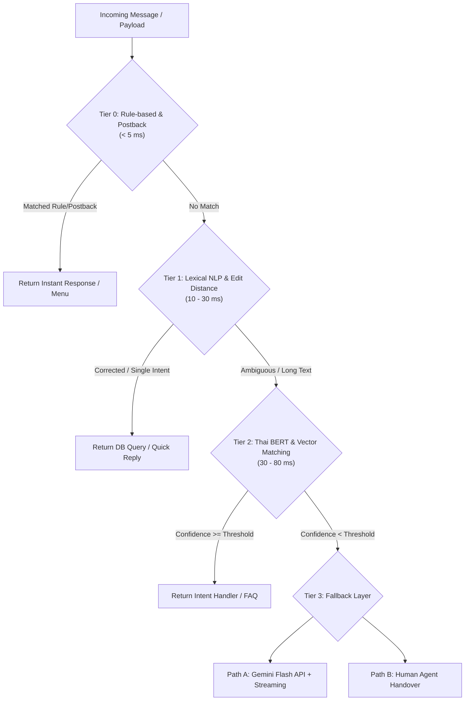

# 🏗️ Tiered / Hierarchical Router Architecture

Backlink: [[index]]

---

## 📌 Architectural Overview

To deliver **sub-second latency (100–300 ms total)**, eliminate expensive LLM API costs, and prevent hallucination in fixed business logic, Chatbot Yuedpao employs a **4-Tier Hierarchical Router Architecture**.

Under this paradigm, incoming user messages are evaluated sequentially from **Tier 0** up to **Tier 3**. The system resolves 70–80% of incoming queries at Tier 0 through Tier 2 without calling external LLM APIs.

---

## ⚡ Tier Breakdown & Specifications

### 🟢 Tier 0: Rule-based & Exact Match
- **Target Latency**: `< 5 ms`
- **Mechanism**: Direct lookup via Exact Keyword Match, Regex patterns, and LINE Rich Menu Postback/Payload events.
- **Handled Case Types**:
  - Menu navigation buttons (e.g. `action=check_status`, `action=store_locator`).
  - Fixed command keywords (e.g., `"เบอร์โทร"`, `"สั่งซื้อ"`, `"เมนู"`).
- **Technology**: Python dictionary lookup, Regex engine (`re.compile`).

---

### 🟡 Tier 1: Lexical & Lightweight NLP
- **Target Latency**: `10 - 30 ms`
- **Mechanism**: Spelling correction for typos and short single-keyword mapping via weighted distance algorithms and Thai Soundex.
- **Handled Case Types**:
  - Minor typos (e.g., `"เกงยีน"` $\rightarrow$ `"กางเกงยีนส์"`, `"เสือยืด"` $\rightarrow$ `"เสื้อยืด"`).
  - Product category short searches.
- **Technology**: SymSpell, Weighted Levenshtein Distance (Keyboard Proximity on เกษมณี/ปัตตะโชติ), PyThaiNLP Soundex.

---

### 🟠 Tier 2: BERT / Small Encoder (Top-Level Ceiling)
- **Target Latency**: `30 - 80 ms`
- **Mechanism**: Deep contextual sentence classification, semantic similarity search against FAQ Vector DB via Cosine Similarity, and Masked BERT context scoring.
- **Handled Case Types**:
  - Complex intent sentences (e.g., `"ผ้ารุ่นไหนใส่แล้วไม่ร้อน เหมาะกับวิ่งบ้าง"` $\rightarrow$ Match intent: `fabric_recommendation`).
  - Size chart queries with multiple entities (e.g., `"สูง 175 น้ำหนัก 70 ใส่ทรง oversize ไซส์อะไร"`).
- **Technology**: WangchanBERTa (`wangchanberta-base-att-spm-uncased`), Cross-Encoder, SQLite VSS / Supabase Vector (pgvector).

---

### 🔴 Tier 3: Fallback & Complex Handlers
- **Target Latency**: `300 - 800 ms` (LLM) or Asynchronous (Live Agent)
- **Mechanism**: Invoked only when Tier 0–2 confidence scores fall below threshold or when questions require open-ended reasoning.
- **Sub-paths**:
  - **Option A (LLM API)**: Gemini 1.5/2.0 Flash API with Streaming Response (`stream_generate_content`) and constrained token generation (strict system prompt, zero explanation).
  - **Option B (Human Agent Handover)**: Tag case based on category (`[Order Issue]`, `[B2B Wholesale]`) and hand over to human customer support agents on LINE Official Account Manager.

---

## 📊 Summary Routing Table

| Tier Level | Match Logic | Latency | Cost per Request | Risk of Hallucination |
|---|---|---|---|---|
| **Tier 0** | Exact Match / Postback / Regex | `< 5 ms` | \$0.00 | **0%** |
| **Tier 1** | Edit Distance + Thai Soundex | `10 - 30 ms` | \$0.00 | **0%** |
| **Tier 2** | WangchanBERTa + Vector Similarity | `30 - 80 ms` | \$0.00 | **0%** |
| **Tier 3 (LLM)** | Gemini Flash API (Streaming) | `300 - 800 ms` | Token API Fee | Low (Constrained Prompt) |
| **Tier 3 (Human)** | Live Agent Notification | Real-time queue | Staff time | **0%** (Human controlled) |

---

## 💡 Key Benefits of Tiered Architecture

1. **Sub-second User Experience**: Over 80% of queries are resolved under 100 ms, delivering an instant app-like experience on LINE.
2. **Predictable Financial Cost**: Prevents API token overuse by executing LLM queries only when necessary.
3. **100% Data Precision**: Crucial business information (prices, return policies, size charts) is served deterministically from the database without LLM hallucination.

---

## 🔗 Related Knowledge Pages
- [[nlp-spelling-correction]] — Detailed implementation of Tier 1 & Tier 2 NLP algorithms.
- [[rubric-evaluation-checkpoints]] — Latency measurement methodology and performance testing.
- [[database-schema]] — Vector embeddings and database tables supporting the router.
