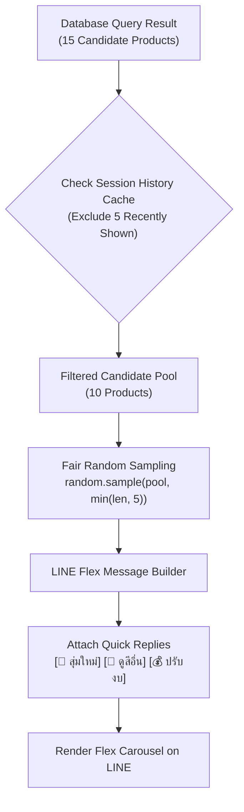

# 🎡 Top 5 Carousel Logic & LINE Flex Message UX

Backlink: [[index]]

---

## 📌 Top 5 Carousel Requirements

When a user searches for products (e.g., `"อยากได้เสื้อยืดโอเวอไซผ้านุ่มๆ ไม่เกิน 400"`), the database query may return a candidate pool larger than 5 items (e.g., 15 items).

To prevent overwhelming the user while providing fresh recommendations on repeat searches:
1. The chatbot limits display to **exactly 5 items** per carousel.
2. An algorithm performs **Weighted / Fair Random Sampling**.
3. A **Session History Cache** tracks items recently shown to prevent back-to-back duplicate recommendations.



---

## 🎲 Fair Randomization & Session History Algorithm

```python
import random
from typing import List, Dict

def get_fair_top5_recommendations(
    candidate_pool: List[Dict], 
    session_history: List[str]
) -> List[Dict]:
    """
    Filters out items recently shown in the current user session,
    then randomly samples up to 5 items. Updates session history.
    """
    # 1. Exclude recently shown product IDs
    fresh_pool = [
        item for item in candidate_pool 
        if item["product_id"] not in session_history
    ]
    
    # 2. Fallback to full pool if fresh pool is depleted (< 5)
    if len(fresh_pool) < 5:
        fresh_pool = candidate_pool
        
    # 3. Fair Random Sampling
    sample_size = min(len(fresh_pool), 5)
    selected_items = random.sample(fresh_pool, sample_size)
    
    # 4. Update session history cache (keep last 10 product_ids)
    new_shown_ids = [item["product_id"] for item in selected_items]
    session_history.extend(new_shown_ids)
    session_history = session_history[-10:]
    
    return selected_items
```

---

## 🎨 LINE Flex Message Carousel JSON Standards

> [!IMPORTANT]
> **Strict Flex Message Formatting Rules**:
> 1. Set image aspect ratio fixed to `aspectRatio: "1:1"` (square) or `"4:3"` (landscape) to prevent uneven image misalignment across bubbles.
> 2. Enforce `maxLines: 2` on product titles to prevent long titles from breaking card height alignment.
> 3. Format prices clearly (e.g. `฿390` with strike-through original price if discounted).

```json
{
  "type": "carousel",
  "contents": [
    {
      "type": "bubble",
      "hero": {
        "type": "image",
        "url": "https://www.yuedpao.com/images/ultrasoft_oversize_navy.jpg",
        "size": "full",
        "aspectRatio": "1:1",
        "aspectMode": "cover"
      },
      "body": {
        "type": "box",
        "layout": "vertical",
        "contents": [
          {
            "type": "text",
            "text": "เสื้อยืด Oversize Ultrasoft - Classic Navy",
            "weight": "bold",
            "size": "md",
            "maxLines": 2,
            "wrap": true
          },
          {
            "type": "text",
            "text": "ผ้านุ่มพิเศษ ไม่ต้องรีด ระบายอากาศดี",
            "size": "xs",
            "color": "#888888",
            "margin": "sm"
          },
          {
            "type": "text",
            "text": "฿390",
            "weight": "bold",
            "size": "xl",
            "color": "#D32F2F",
            "margin": "md"
          }
        ]
      },
      "footer": {
        "type": "box",
        "layout": "vertical",
        "contents": [
          {
            "type": "button",
            "action": {
              "type": "uri",
              "label": "สั่งซื้อเลย",
              "uri": "https://www.yuedpao.com/product/ultrasoft-navy"
            },
            "style": "primary",
            "color": "#111111"
          }
        ]
      }
    }
  ]
}
```

---

## 🔘 Quick Reply Interactive Actions

Underneath every Carousel output message, the chatbot attaches Quick Reply pill buttons to allow instant iteration:

- `[🎲 สุ่มใหม่ 5 ตัว]`: Re-runs the `get_fair_top5_recommendations()` function with the current filter pool, drawing 5 different items.
- `[🎨 ดูสีอื่น]`: Triggers a color variant selection menu.
- `[💰 ปรับงบ]`: Prompts the user to adjust maximum price filter.

---

## 🔗 Related Knowledge Pages
- [[core-features-rich-menu]] — Shopping and Promotion features breakdown.
- [[rubric-evaluation-checkpoints]] — Rubric scoring for Carousel Logic & UX (20% + 15%).
- [[database-schema]] — Session state caching tables.
