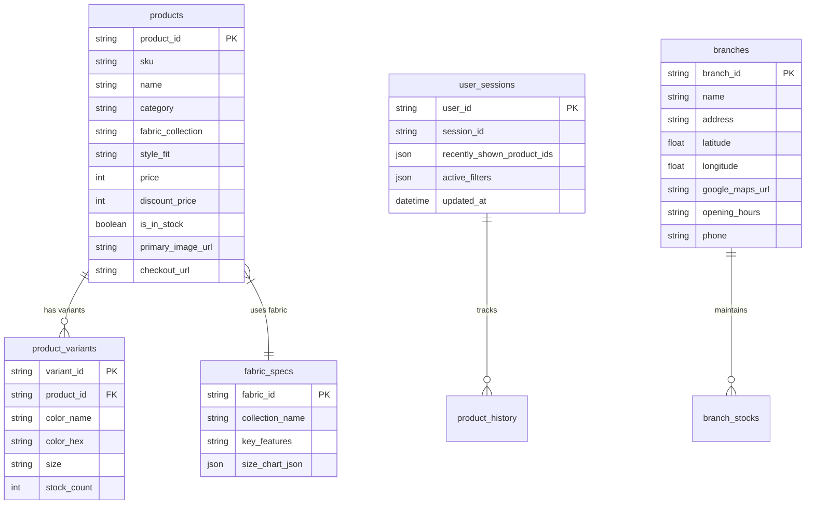

# 🗄️ Database Schema & Storage Specifications

Backlink: [[index]]

---

## 📌 Database Architecture Overview

Chatbot Yuedpao supports dual database backends:
1. **SQLite (Local / Lightweight)**: Ideal for local development, fast unit testing, and edge deployments.
2. **Supabase / PostgreSQL (Production Cloud)**: Used for cloud deployment, vector embeddings search (`pgvector`), and real-time synchronization.

---

## 📐 Entity Relationship & Tables Schema



---

## 📋 Table Definitions

### 1. `products` Table
Stores scraped product master catalog details.

```sql
CREATE TABLE products (
    product_id VARCHAR(64) PRIMARY KEY,
    sku VARCHAR(64) UNIQUE NOT NULL,
    name VARCHAR(255) NOT NULL,
    category VARCHAR(64) NOT NULL,              -- e.g. 'เสื้อยืด', 'โปโล', 'กางเกง'
    fabric_collection VARCHAR(64) NOT NULL,     -- e.g. 'Non-iron', 'Ultrasoft', 'Tailor Cool'
    style_fit VARCHAR(64) NOT NULL,             -- e.g. 'Oversize', 'Crop', 'Unisex'
    price INTEGER NOT NULL,
    discount_price INTEGER DEFAULT NULL,
    is_in_stock BOOLEAN DEFAULT TRUE,
    primary_image_url TEXT NOT NULL,
    checkout_url TEXT NOT NULL,
    created_at TIMESTAMP DEFAULT CURRENT_TIMESTAMP
);
```

---

### 2. `product_variants` Table
Stores color, size, and stock variants per product.

```sql
CREATE TABLE product_variants (
    variant_id VARCHAR(64) PRIMARY KEY,
    product_id VARCHAR(64) REFERENCES products(product_id) ON DELETE CASCADE,
    color_name VARCHAR(64) NOT NULL,             -- e.g. 'Amber Wood', 'Shadow Gray'
    color_hex VARCHAR(16) DEFAULT NULL,          -- e.g. '#1B263B'
    size VARCHAR(16) NOT NULL,                   -- e.g. 'XS', 'S', 'M', 'L', 'XL', '2XL', '3XL'
    stock_count INTEGER DEFAULT 0
);
```

---

### 3. `fabric_specs` Table
Stores fabric technology details and size charts.

```sql
CREATE TABLE fabric_specs (
    fabric_id VARCHAR(64) PRIMARY KEY,
    collection_name VARCHAR(64) UNIQUE NOT NULL, -- e.g. 'Non-iron', 'Ultrasoft'
    key_features TEXT NOT NULL,
    care_instructions TEXT NOT NULL,
    size_chart_json JSON NOT NULL                -- { "S": {"chest": 36, "length": 27}, ... }
);
```

---

### 4. `branches` Table
Stores physical Yuedpao store locations for O2O navigation.

```sql
CREATE TABLE branches (
    branch_id VARCHAR(64) PRIMARY KEY,
    name VARCHAR(255) NOT NULL,                  -- e.g. 'สาขา เซ็นทรัล เวสต์เกต'
    address TEXT NOT NULL,
    latitude DOUBLE PRECISION NOT NULL,
    longitude DOUBLE PRECISION NOT NULL,
    google_maps_url TEXT NOT NULL,
    opening_hours VARCHAR(128) NOT NULL,         -- e.g. '10:00 - 22:00'
    phone VARCHAR(32) DEFAULT NULL
);
```

---

### 5. `faqs` Table (Vector Search Enabled)
Stores FAQ entries with pre-computed vector embeddings for Tier 2 WangchanBERTa matching.

```sql
CREATE TABLE faqs (
    faq_id VARCHAR(64) PRIMARY KEY,
    intent_name VARCHAR(64) NOT NULL,
    question TEXT NOT NULL,
    answer TEXT NOT NULL,
    embedding vector(768) DEFAULT NULL            -- 768-dim vector for WangchanBERTa
);
```

---

### 6. `user_sessions` Table
Stores active user search filters and recent carousel history cache.

```sql
CREATE TABLE user_sessions (
    user_id VARCHAR(128) PRIMARY KEY,             -- LINE User ID
    session_id VARCHAR(64) NOT NULL,
    recently_shown_product_ids JSON DEFAULT '[]', -- Array of last 10 shown product_ids
    active_filters JSON DEFAULT '{}',             -- Currently active search filters
    updated_at TIMESTAMP DEFAULT CURRENT_TIMESTAMP
);
```

---

## 🔗 Related Knowledge Pages
- [[product-catalog-scraping]] — Data sources populating the products and branches tables.
- [[carousel-randomization]] — Reading and writing `recently_shown_product_ids` in `user_sessions`.
- [[architecture-tiered-router]] — Vector query execution on `faqs` table in Tier 2.
