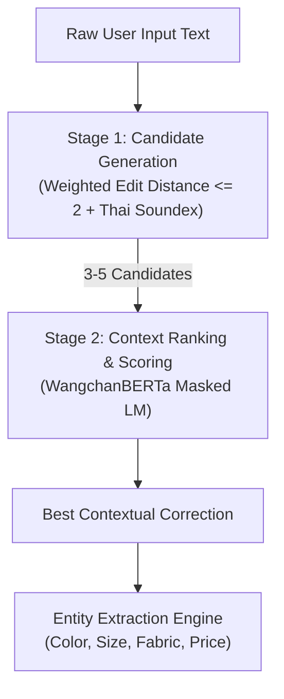

# 🧠 Thai NLP & Hybrid Spelling Correction Pipeline

Backlink: [[index]]

---

## 📌 Technical Rationale

Thai Natural Language Processing presents unique challenges:
1. **No Word Boundaries (Tokenization Bottleneck)**: Thai script has no spaces between words. Typos disrupt word tokenizers, causing cascading errors across the entire pipeline.
2. **Keyboard Proximity Errors**: Frequent adjacent key slips on Thai Kedmanee (เกษมณี) and Pattajoti (ปัตตะโชติ) layouts (e.g. `ก` vs `ด`, `เ` vs `แ`).
3. **Phonetic & Homophone Errors**: Phonetic spelling based on spoken sounds rather than formal orthography (e.g., `นะคะ` $\rightarrow$ `นะค่ะ`, `สัมมนา` $\rightarrow$ `สัมนา`).

To overcome these challenges rapidly without heavy computation, Chatbot Yuedpao implements a **Two-Stage Hybrid Architecture**: **Edit Distance (Candidate Generation)** + **Thai BERT (Context Scoring)**.

---

## ⚙️ Two-Stage Hybrid Architecture

---

## 🔹 Stage 1: Candidate Generation (Lexical & Phonetic Filtering)

When an Out-of-Vocabulary (OOV) term or potential typo is detected:

### 1. Weighted Edit Distance ($ED \le 2$)
Calculates Levenshtein / Damerau-Levenshtein distance against the [[product-catalog-scraping#5-domain-vocabulary-dictionary|Yuedpao Domain Vocabulary Dictionary]]. 

Weight adjustments are applied based on keyboard layout proximity:
$$\text{Cost}(\text{swap adjacent keys}) = 0.5 \quad \text{vs} \quad \text{Cost}(\text{distant key insertion}) = 1.0$$

*Example Keyboard Proximity Pairs*:
- `ก` $\leftrightarrow$ `ด`
- `เ` $\leftrightarrow$ `แ`
- `้` (ไม้โท) $\leftrightarrow$ `่` (ไม้เอก)

### 2. Thai Soundex Integration
For homophones and phonetic errors, the PyThaiNLP Soundex algorithm converts input words into phonetic codes, matching words that sound identical despite spelling differences.
- `นะค่ะ` $\rightarrow$ Matches `นะคะ`
- `สัมนา` $\rightarrow$ Matches `สัมมนา`

*Output of Stage 1*: Candidate list pruned down to **3–5 candidates**.
*Example*: Input `"ไปเท่ยว"` $\rightarrow$ Candidate List: `["ไปเที่ยว", "ไปเหี่ยว", "ไปเลี้ยว"]`

---

## 🔹 Stage 2: Candidate Ranking & Context Scoring (WangchanBERTa)

Once 3–5 candidates are generated, **WangchanBERTa** (`wangchanberta-base-att-spm-uncased`) selects the candidate that best fits the sentence context.

Two scoring methods are supported:

### 1. Masked Language Modeling (MLM Scoring)
1. Replace the target word with the `<mask>` token:
   $$\text{"วันนี้เราจะ [MASK] ทะเล"}$$
2. Feed the masked string into WangchanBERTa.
3. Compute Softmax probability logits for each candidate from Stage 1:
   $$P(\text{เที่ยว} \mid \text{context}) = 0.92, \quad P(\text{เหี่ยว} \mid \text{context}) = 0.03, \quad P(\text{เลี้ยว} \mid \text{context}) = 0.05$$
4. Select Candidate with the highest probability (`ไปเที่ยว`).

### 2. Perplexity / Pseudo-Log-Likelihood
Reconstruct full candidate sentences and evaluate total sequence loss. The sentence with minimum perplexity score is selected.

---

## 🔍 Entity Extraction Engine

After text normalization and spelling correction, the message is processed by the **Entity Extraction Engine** to populate search filters for database queries:

| Entity Type | Extracted Keys / Normalization | Example Input $\rightarrow$ Extracted Value |
|---|---|---|
| **Category** | `เสื้อยืด`, `เสื้อเชิ้ต`, `โปโล`, `กางเกง`, `ชุดกีฬา` | `"ขอซื้อเกงยีนส์"` $\rightarrow$ `Category: กางเกง` |
| **Fabric** | `Non-iron`, `Ultrasoft`, `Tailor Cool`, `MotionSkin` | `"เอาผ้าไม่ต้องรีด"` $\rightarrow$ `Fabric: Non-iron` |
| **Style/Fit** | `Oversize`, `Crop`, `Unisex`, `KIDS`, `Regular` | `"ขอโอเวอไซ"` $\rightarrow$ `Style: Oversize` |
| **Color** | `Amber Wood`, `Shadow Gray`, `Salmon Rose`, `ดำ`, `ขาว` | `"เสื้อยืดสี amber wood"` $\rightarrow$ `Color: Amber Wood` |
| **Size** | `XS`, `S`, `M`, `L`, `XL`, `2XL`, `3XL` | `"รอบอก 42"` $\rightarrow$ `Size: L` |
| **Price Limit** | Integer max budget | `"งบไม่เกิน 400"` $\rightarrow$ `Max_Price: 400` |

---

## ⚡ Performance Comparison Table

| Metric | Single Edit Distance | Single BERT Model | Hybrid (Edit Distance + BERT) |
|---|---|---|---|
| **Context Awareness** | ❌ None (picks first closest match) | ✅ High | ✅ High |
| **Search Space** | 🟢 Small (Dict based) | 🔴 Huge (30,000+ Vocab) | 🟢 Focused (3-5 candidates) |
| **Latency** | ⚡ 5-15 ms | 🐢 150-400 ms | 🚀 **30-50 ms** |
| **Hallucination Risk**| 0% | Moderate | **0%** |

---

## 🔗 Related Knowledge Pages
- [[architecture-tiered-router]] — How the NLP pipeline plugs into Tier 1 and Tier 2 routing.
- [[product-catalog-scraping]] — Domain dictionary source data and entity schemas.
- [[rubric-evaluation-checkpoints]] — NLP test utterances and accuracy benchmarks.
