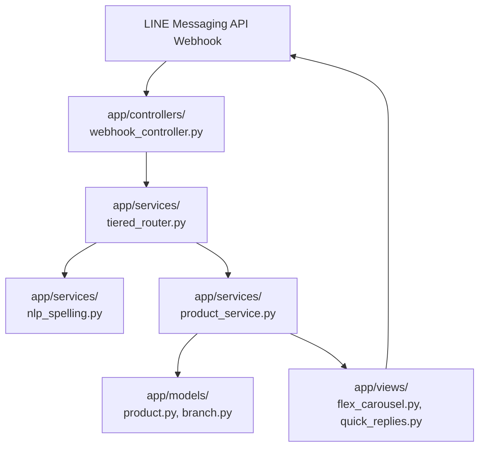

# 🏢 Project Code Architecture (MVC + Services Layered Pattern)

Backlink: [[index]]

---

## 📌 Architectural Pattern Overview

Chatbot Yuedpao follows a **Layered MVC + Services Architecture** to ensure modularity, high testability, and clean separation of concerns:

- **Model (`app/models/`)**: Defines database entities, schemas, and data structures (Products, Variants, Fabric specs, Store Branches, Session history).
- **View (`app/views/`)**: Constructs LINE Official Account presentation components (LINE Flex Message Carousel JSONs, Fabric comparison cards, Quick Reply pills, Rich Menu grid configs).
- **Controller (`app/controllers/`)**: Manages HTTP endpoints (LINE Webhook `/callback`, Admin trigger routes).
- **Services (`app/services/`)**: Houses core business logic engines (4-Tier Router, Thai Edit Distance + WangchanBERTa NLP pipeline, Yuedpao Web Scraper, Product DB query service).

---

## 📂 Directory & File Reference Blueprint

| Layer / Folder | File Path | Description & Responsibility |
|---|---|---|
| **Core Entry** | `app/main.py` | FastAPI application initialization and route mounting. |
| **Core Config** | `app/config.py` | Environment variables, LINE tokens, DB URLs. |
| **Models** | `app/models/product.py` | Product, Variant, and Fabric SQLAlchemy/Pydantic data schemas. |
| **Models** | `app/models/branch.py` | Store location branch data model with Lat/Long coordinates. |
| **Models** | `app/models/session.py` | User carousel history cache and active search filters. |
| **Views** | `app/views/flex_carousel.py` | Generates Top 5 product carousel Flex Message JSON (`aspectRatio: "1:1"`). |
| **Views** | `app/views/flex_fabric.py` | Generates interactive Fabric Technology Comparison card. |
| **Views** | `app/views/quick_replies.py` | Generates Quick Reply pill action buttons (`[🎲 สุ่มใหม่]`, `[ดูสีอื่น]`). |
| **Views** | `app/views/rich_menu_views.py` | Manages 6-Grid Rich Menu layouts and postback actions. |
| **Controllers**| `app/controllers/webhook_controller.py` | Handles incoming LINE Webhook events (`POST /callback`). |
| **Controllers**| `app/controllers/admin_controller.py` | Admin endpoints to trigger batch scraper and view stats. |
| **Services** | `app/services/tiered_router.py` | 4-Tier Hierarchical Router Engine (Tier 0 to Tier 3 dispatch logic). |
| **Services** | `app/services/nlp_spelling.py` | Hybrid Edit Distance ($ED \le 2$) + WangchanBERTa context ranking. |
| **Services** | `app/services/scraper_service.py` | Offline batch scraper pipeline for Yuedpao.com. |
| **Services** | `app/services/product_service.py` | Repository query service & Fair Top 5 Randomization algorithm. |

---

## 🔗 Related Knowledge Pages
- [[architecture-tiered-router]] — 4-Tier Router System detail.
- [[database-schema]] — Database tables mapping to `app/models/`.
- [[rubric-evaluation-checkpoints]] — Code quality evaluation criteria (15%).
