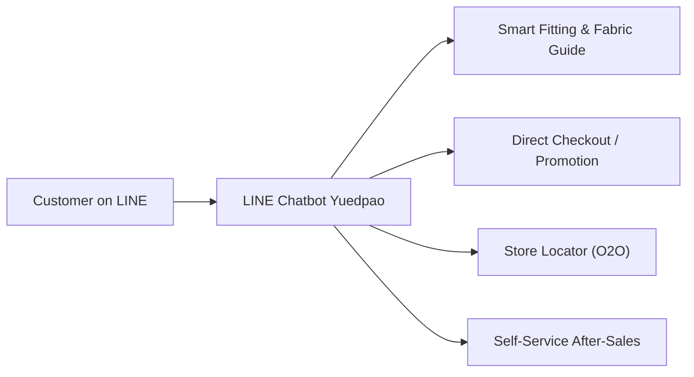

# 🚀 Project Overview - Chatbot Yuedpao

Backlink: [[index]]

---

## 📌 Executive Summary

**Chatbot Yuedpao** is an intelligent LINE Official Account Chatbot engineered specifically for **Yuedpao (ยืดเปล่า)** — Thailand's leading apparel brand known for innovative fabric technologies (e.g. *Non-iron*, *Ultrasoft*, *Tailor Cool Polo*, *MotionSkin*, *Ultra Flow*). 

The primary mission of the chatbot is to resolve customer hesitation around clothing sizes and fabric properties, accelerate the direct sales funnel, automate after-sales service, and bridge offline physical store locations with online channels (O2O).

---

## 🎯 Business Goals & Value Proposition

> [!IMPORTANT]
> The core goal is to reduce conversation drop-off, guarantee sub-second response latency (< 300 ms for 80% of queries), eliminate API token inflation, and maintain 100% deterministic accuracy for business logic.

1. **Reduce Purchase Hesitation**: Answer "What size should I wear?" and "How do these fabrics differ?" instantly using interactive size recommendation engines and fabric visual guides.
2. **Accelerate Conversions**: Streamline product discovery via category carousels, Flash Sale alerts, and 1-click checkout links to Yuedpao.com and LINE SHOPPING.
3. **Automate After-Sales**: Handle order tracking, return/exchange requests, and defective product reporting without manual human agent overhead.
4. **Drive O2O Store Traffic**: Leverage LINE location sharing to guide users to the nearest physical Yuedpao store branch with real-time operating hours and Google Maps navigation.

---

## 👕 Yuedpao Brand Fabric Technology Matrix

| Fabric Collection | Key Feature & Unique Selling Proposition (USP) | Target Occasion / Fit |
|---|---|---|
| **Non-iron** | ไม่ต้องรีด ซัก สะบัด ตาก ใส่ได้ทันที ประหยัดเวลา | Daily wear, Work, Travel |
| **Ultrasoft** | ผ้านุ่มพิเศษ ใส่สบาย ระบายอากาศดีเยี่ยม คอกลม/คอวี | Relaxed casual days, Basics |
| **Tailor Cool Polo** | เสื้อโปโลลุคทำงาน ระบายความร้อน อยู่ทรง ดูดี | Smart casual, Work, Office |
| **MotionSkin / Ultra Flow** | ผ้าออกกำลังกาย ยืดหยุ่น 4 ทิศทาง แห้งไว | Activewear, Gym, Outdoor sports |
| **Feather Comfort** | ผ้าเบาบางดุจขนนก สัมผัสเย็นสบาย | Hot summer days |

---

## 👥 Target User Personas & Solved Pain Points

### 1. The Undecided Online Shopper ("What size fits me?")
- **Pain Point**: Fearing size mismatch when ordering online.
- **Solution**: [[core-features-rich-menu#1-smart-fitting--fabric-guide|Smart Fitting Bot]] takes height + weight + chest measurements and outputs recommended size across Unisex, Oversize, Crop, or Kids sizing charts.

### 2. The Tech-Savvy Fast Shopper ("Where is the promo link?")
- **Pain Point**: Spending time searching for current Flash Sales and discounts.
- **Solution**: [[carousel-randomization|Flex Message Carousel]] rendering top 5 deals with direct 1-click checkout buttons.

### 3. The Offline Branch Visitor ("Is there a store near me?")
- **Pain Point**: Wanting to try on the physical fabric before buying.
- **Solution**: [[core-features-rich-menu#3-store-locator---o2o|Store Locator]] receives user location and returns nearby shopping mall branches with Google Maps navigation.

---

## 🔗 Related Knowledge Pages
- [[architecture-tiered-router]] — Architectural breakdown of the sub-second 4-tier routing engine.
- [[nlp-spelling-correction]] — Thai spelling correction and intent classification pipeline.
- [[core-features-rich-menu]] — Complete feature walkthrough and Rich Menu grid layout.
